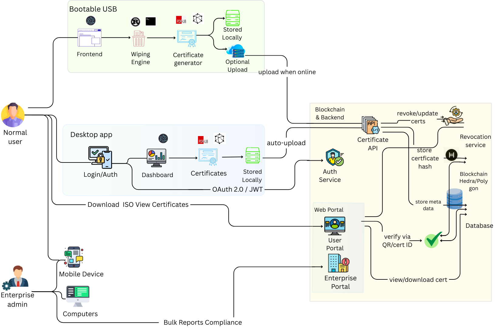
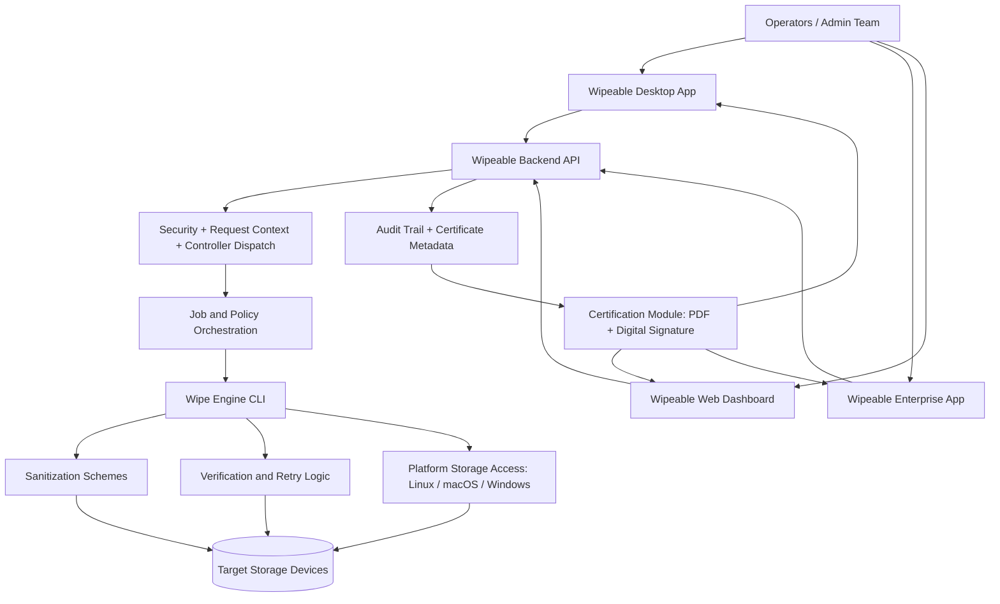
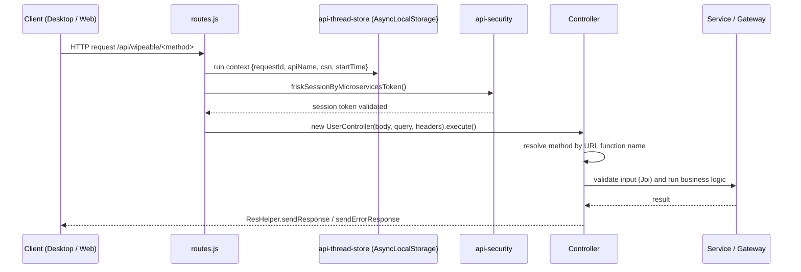
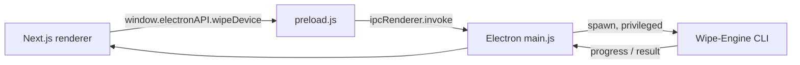
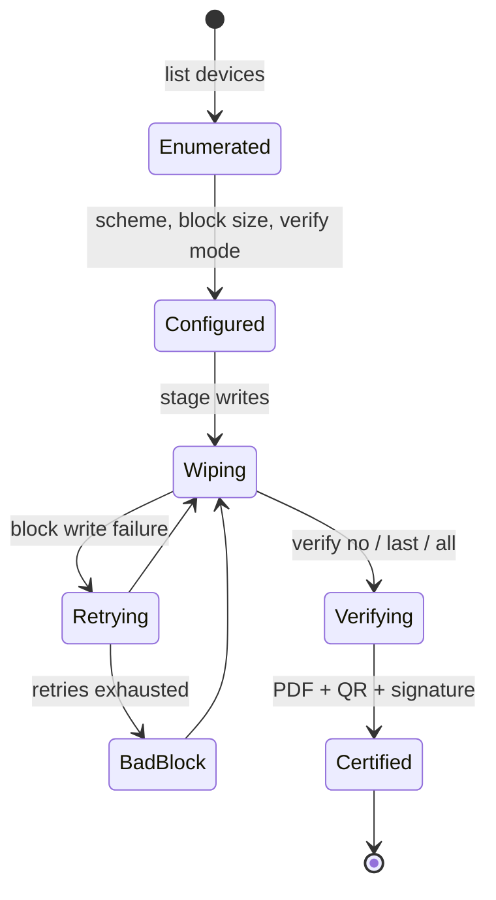

# Wipeable

> Secure, verifiable, audit-ready data sanitization for institutions and enterprises. Built for **Smart India Hackathon (SIH) 2025**.


**Demo video:** [Wipeable – Secure Data Wiping Software (Google Drive)](https://drive.google.com/file/d/1h0vT-ezneRXM6OJp9mwV-traJt2Hbxea/view?usp=sharing)
| **Pitch deck:** [PPT.pdf](./PPT.pdf)
| **Business model:** [WIPEABLE BUSINESS MODEL.pdf](./WIPEABLE%20BUSINESS%20MODEL.pdf)

---

## Table of Contents

1. [About](#about)
2. [Key Features](#key-features)
3. [System Architecture](#system-architecture)
4. [Tech Stack](#tech-stack)
5. [Folder Structure](#folder-structure)
6. [Web Logic and Architecture Design](#web-logic-and-architecture-design)
7. [Security and Compliance](#security-and-compliance)
8. [Implementation Status](#implementation-status)
9. [Getting Started](#getting-started)
10. [Demo Flow](#demo-flow)
11. [Roadmap](#roadmap)
12. [Safety Notice](#safety-notice)
13. [License and Acknowledgements](#license-and-acknowledgements)

---

## About

Wipeable is a device sanitization and compliance platform. It pairs a high-performance **Rust wipe engine** with a **Node.js control plane** and **Next.js / Electron** clients, so organizations can securely execute, orchestrate, and verify irreversible data destruction, then prove it with signed certificates.

### Problem

Organizations still rely on manual formatting, inconsistent tools, or undocumented decommissioning. This creates three risks:

1. **Data leakage** from incomplete sanitization.
2. **Operational inconsistency** across teams and device types.
3. **No compliance evidence** for audits.

### Target Users

- IT asset disposal teams
- Government and institutional infrastructure teams
- Data center and device refresh operations
- Compliance and security auditors

## Key Features

- Cross-platform storage enumeration and wiping (Linux, macOS, Windows).
- Multiple sanitization schemes: `zero`, `random`, `random2x`, `badblocks`, `gost`, `dod`, `vsitr`.
- Verification modes (`no`, `last`, `all`), configurable block size and offset, retries, and bad-block tracking.
- Operator UI (Desktop and Enterprise) for device selection, wipe jobs, progress, reports, and settings.
- Web dashboard modules for jobs, verification, certificates, history, users, and notifications.
- NIST SP 800-88 style PDF certificates with an embedded QR code (serial + hash) and PKCS#12 digital signature.

---

## System Architecture

Wipeable separates concerns into four planes.

| Plane | Responsibility | Modules |
|---|---|---|
| Experience | Operator and admin interfaces | `Wipeable-Desktop`, `Wipeable-Enterprise`, `Wipeable-Website` |
| Control | API entry, request context, security, dispatch, orchestration | `Wipeable-Backend` |
| Execution | Destructive writes, verification, retries | `Wipe-Engine` |
| Evidence | Certificates, reports, audit trail | `Certification-Module` |





---

## Tech Stack

| Module | Language / Runtime | Frameworks and Libraries |
|---|---|---|
| `Wipe-Engine` | Rust | `clap` (CLI), `rand` / `rand_chacha` (patterns), `indicatif` + `console` + `prettytable-rs` (terminal UI), `serde`, `anyhow` / `thiserror`, `roaring` (bad-block bitmaps), `regex`, `plist` (macOS); `nix` + `sysfs-class` (Unix), `winapi` + `widestring` (Windows) |
| `Wipeable-Backend` | Node.js 20+ | Express 5, Joi (validation), jsonwebtoken (JWT), Sequelize + sqlite3 (ORM / storage), pino (logging), axios, dotenv, uuid, nodemon, ESLint |
| `Wipeable-Desktop` | Electron + TypeScript | Next.js 15, React 19, Tailwind CSS 4, lucide-react, Clerk (auth), Express 4 + cors (shell) |
| `Wipeable-Enterprise` | Electron + TypeScript | Same stack as Desktop (enterprise variant) |
| `Wipeable-Website` | Next.js 15 (App Router) | React 19, MUI 7 + Emotion, framer-motion, react-hook-form, Recharts, axios, date-fns, lodash-es, react-slick |
| `Certification-Module` | Node.js | pdf-lib, @pdf-lib/fontkit, node-signpdf (PKCS#12 signing), qrcode |

---

## Folder Structure

### Repository root

```text
wipeable/
├── Wipe-Engine/            # Rust wipe engine (execution plane)
├── Wipeable-Backend/       # Express API (control plane)
├── Wipeable-Desktop/       # Electron + Next.js operator app
├── Wipeable-Enterprise/    # Enterprise variant of the desktop app
├── Wipeable-Website/       # Next.js website and dashboard
├── Certification-Module/   # PDF certificate generation + signing
├── Architecture.png        # Architecture diagram
├── PPT.pdf                 # SIH presentation
├── WIPEABLE BUSINESS MODEL.pdf
└── README.md
```

### `Wipe-Engine/`

```text
Wipe-Engine/
├── src/
│   ├── main.rs             # CLI entrypoint (list, wipe)
│   ├── actions/            # wipe.rs (orchestration), marker.rs (bad blocks)
│   ├── sanitization/       # stage.rs (patterns), mem.rs, mod.rs (schemes)
│   ├── storage/
│   │   ├── nix/            # linux.rs, macos.rs
│   │   └── windows/        # access.rs, meta.rs, helpers.rs, misc.rs
│   └── ui/                 # args.rs, cli.rs, idshortcuts.rs, storage_repo.rs
├── testing/                # Test fixtures
├── ALGORITHM.md  ARCHITECTURE.md  DATA_FLOW.md
├── BACKEND_ARCHITECTURE.md  COMMAND_REFERENCE.md  CHANGELOG.md
├── Cargo.toml  Cargo.lock  Vagrantfile  release.toml  LICENSE
```

### `Wipeable-Backend/`

```text
Wipeable-Backend/
├── env/                    # env-checker.js, .env.<region>.<env> files
├── src/
│   ├── server.js           # Loads env, starts HTTP server
│   ├── app.js              # Mounts routers
│   ├── config/             # config-env.js, i18n/
│   ├── routes/             # routes.js (health + context), wipeable-routes.js
│   ├── routes-middlewares/ # api-security.js, api-thread-store.js
│   ├── routes-controllers/ # base-controller.js, user-controller.js
│   ├── services/           # Business logic (user/, ...)
│   ├── services-gateways/  # gateway-base.js (external integrations)
│   └── utils/              # auth-jwt, input-validator, req/res-helper,
│                           # mnh-logger, mnh-exception, http-connector, container-cache
├── eslint.config.mjs
└── package.json
```

### `Wipeable-Desktop/` and `Wipeable-Enterprise/`

Both share the same layout.

```text
Wipeable-Desktop/
├── main.js                 # Electron main process, window lifecycle, IPC handlers
├── preload.js              # Secure IPC bridge (window.electronAPI.wipeDevice)
├── package.json
└── frontend/               # Next.js app (own package.json)
    └── app/
        ├── layout.tsx  page.tsx  globals.css
        ├── components/     # sidebar.tsx
        ├── wipe/           # Device selection and wipe flow
        ├── reports/        # Reports and certificates
        └── settings/       # Preferences and policy
```

### `Wipeable-Website/`

```text
Wipeable-Website/src/
├── app/                    # App Router: layout, (default)/, dashboard/, login/, api/
│   └── ProviderWrapper.jsx # Theme, config, and auth providers
├── blocks/                 # Reusable sections: hero, pricing, faq, metrics, navbar, footer...
├── views/                  # Page-level compositions (landings/, sections/)
├── components/             # Shared UI components
├── contexts/               # AuthContext, ConfigContext
├── hooks/                  # useConfig, useLocalStorage, useDataThemeMode, ...
├── utils/                  # theme.js, validationSchema.js, constant.js, ...
├── data/  images/  icons/  styles/
├── config.js  path.js  enum.js  metadata.js  middleware.js  branding.json
```

### `Certification-Module/`

```text
Certification-Module/
├── generateAndSign.js           # Builds, embeds QR, and signs the certificate
├── nist_certificate_blank.pdf   # Template
├── nist_certificate_formatted.pdf / nist_certificate_signed.pdf   # Outputs
├── cert.p12  cert.pem  key.pem  # Signing material (see Security notes)
└── package.json
```

---

## Web Logic and Architecture Design

### Backend request lifecycle



1. **Environment**: `server.js` loads `env/.env.<region>.<env>` from `ECS_REGION` and `ECS_ENV`.
2. **Context**: `routes.js` opens an `AsyncLocalStorage` scope per request, storing `requestId` (from `mnh-x-request-id` header or a new UUID), the API function name parsed from the URL, request start time, and the client short name (`csn`, taken from the host sub-domain or `LOCALHOST_CSN`).
3. **Security**: `api-security` extracts the bearer token into the request context before the controller runs. RS256 JWT verification and client-name matching are written but currently commented out, so requests are **not yet authenticated**.
4. **Dispatch**: `BaseController.execute()` maps the URL function name to a controller method and throws `resourceNotFound` for unknown names. Subclasses define one method per API action and validate input with Joi through `validateInputParameters`.
5. **Response**: every result and error is normalized by `ResHelper` into `{ status, message, data, ts, requestId, v }`.

### API surface

| Endpoint | Purpose |
|---|---|
| `GET /api/health` | Liveness: uptime, event-loop delay, memory usage |
| `* /api/wipeable/<method>` | Secured action endpoint; `<method>` resolves to a controller method |

Wipe, job, and certificate controller methods are planned and not yet implemented (see [Implementation Status](#implementation-status)).

### Desktop IPC flow



The renderer never touches the filesystem or the engine directly. Only whitelisted calls exposed in `preload.js` reach the main process. The `wipe-device` handler in `main.js` is currently a stub; the engine spawn is the planned integration point.

### Website structure

- **App Router** layouts initialize providers (theme, config, auth) in `ProviderWrapper.jsx`.
- **Composition chain**: `blocks/` (sections) are assembled into `views/` (pages), which are mounted by routes in `app/`.
- `middleware.js` handles route-level concerns; `config.js`, `path.js`, and `enum.js` centralize configuration, route constants, and enumerations.

### Wipe job and evidence pipeline



Certificate flow: wipe result and verification, then serial and hash, then PDF with QR, then PKCS#12 signature, then a signed PDF for audit.

### Design principles

- **Plane separation**: the engine is replaceable and independently testable; UIs never perform destructive operations.
- **Privilege isolation**: only the process that spawns the engine needs administrator/root rights.
- **Traceability**: every request carries a `requestId` and `csn` through logs and responses.
- **Assurance vs speed**: verification mode is a per-job policy choice.

See `Wipe-Engine/ARCHITECTURE.md`, `ALGORITHM.md`, `DATA_FLOW.md`, and `COMMAND_REFERENCE.md` for engine internals.

---

## Security and Compliance

- Privileged execution model for real wipe operations.
- Verification options (`no`, `last`, `all`) trade speed for assurance.
- Certificates follow NIST SP 800-88 style reporting; schemes include DoD 5220.22-M and VSITR.
- Planned: administrator controls, encrypted logs, export governance, role-based approvals.
- **Signing keys**: `Certification-Module` contains `cert.p12`, `cert.pem`, and `key.pem`, and `generateAndSign.js` hardcodes a placeholder passphrase. Treat these as development-only; never commit production keys, and load the passphrase from an environment variable.
- **API authentication**: backend JWT verification is scaffolded but disabled (see [Backend request lifecycle](#backend-request-lifecycle)); enable it before any real deployment.

## Implementation Status

| Capability | State |
|---|---|
| Disk enumeration and wipe execution (CLI) | Implemented |
| Schemes, verification, retries, bad-block handling | Implemented |
| Backend routing, context store, response/error wrappers | Implemented baseline |
| Security middleware | Scaffold, hardening ongoing |
| Desktop / Enterprise operator UI | Screens implemented, prototype-heavy |
| Jobs / verification / certificates dashboards | UI modules with mock data |
| Certificate PDF generation and signing | Standalone module implemented |
| End-to-end engine invocation from UI | In progress |
| Persistent certificate lifecycle and immutable audit logs | Pending |

---

## Getting Started

### Prerequisites

- Node.js 20+ and npm 9+
- Rust toolchain (`rustup`, `cargo`)
- Administrator/root privileges for real device wipes

### Wipe Engine

```bash
cd Wipe-Engine
cargo build
cargo run -- list
# DANGEROUS: destroys data
# cargo run -- wipe <device_id> --scheme random2x --verify last --yes
```

| Option | Values | Default |
|---|---|---|
| `-s, --scheme` | `zero`, `random`, `random2x`, `badblocks`, `gost`, `dod`, `vsitr` | `random2x` |
| `-v, --verify` | `no`, `last`, `all` | `last` |
| `-b, --blocksize` | 512 B to 64 MB (`4k`, `1m`) | `1m` |
| `-o, --offset` | bytes (`1g`, `100m`) | `0` |
| `--retries` | max retries per failed block | engine default |

### Backend

```bash
cd Wipeable-Backend
npm install
npm run dev
# GET http://localhost:3000/api/health
```

| Variable | Purpose |
|---|---|
| `ECS_ENV` | Environment, e.g. `dev`, `prod` |
| `ECS_REGION` | Region, e.g. `local`, `us1` |
| `LOCALHOST_CSN` | Default client short name for localhost |

Env files are resolved as `env/.env.<region>.<env>`.

### Desktop and Enterprise apps

```bash
cd Wipeable-Desktop        # or Wipeable-Enterprise
npm install
cd frontend && npm install && cd ..
npm run dev
```

### Website

```bash
cd Wipeable-Website
npm install
npm run dev
```

### Certification Module

```bash
cd Certification-Module
npm install
# Ensure cert.p12 exists and the passphrase is configured
node generateAndSign.js
```

---

## Demo Flow

1. Enumerate storage devices from the engine.
2. Choose a wipe policy (scheme, passes, verify mode).
3. Trigger the wipe job from the operator interface.
4. Monitor stage-wise progress and retry handling.
5. Run verification and generate the signed certificate.
6. Review job history and compliance dashboards.

## Roadmap

1. Backend-to-engine orchestration for real-time job execution.
2. Replace UI mock data with persistent job, certificate, and audit services.
3. Wire certificate signing into the backend and add tamper-evident audit chains.
4. Policy templates per organization and compliance profile.
5. Role-based access and approval workflows for high-risk wipes.

## Safety Notice

The wipe engine performs **irreversible destructive writes**. Double-check device identifiers before running any `wipe` command, and test on disposable media first.

## License and Acknowledgements

- `Wipe-Engine` is licensed under [Apache 2.0](./Wipe-Engine/LICENSE) and is based on the open-source [Lethe](https://github.com/Kostassoid/lethe) project.
- The other modules do not yet declare a license; add one before public release.
- Built by Tejas Santosh Nalawade for SIH 2025.
