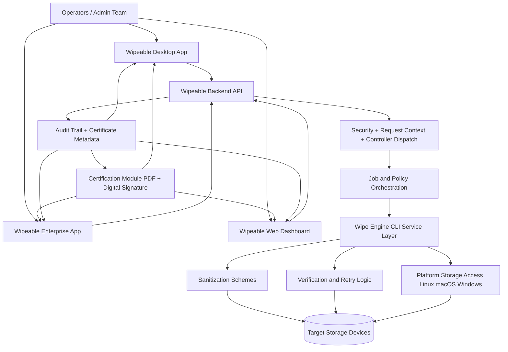

# Wipeable Monorepo

This repository contains the full Wipeable platform: a secure data wipe engine, backend APIs, desktop clients, enterprise client, certification generator/signing module, and marketing/product website.

## Repository Overview

The workspace is organized into six main applications/modules:

1. `Wipe-Engine` (Rust): low-level, cross-platform storage wipe engine.
2. `Wipeable-Backend` (Node.js/Express): API layer, request context, validation, and controller dispatch.
3. `Wipeable-Desktop` (Electron + Next.js): desktop product shell and operator UI.
4. `Wipeable-Enterprise` (Electron + Next.js): enterprise variant of the desktop shell and UI.
5. `Wipeable-Website` (Next.js + MUI): web experience, landing pages, dashboard blocks, and shared UI building blocks.
6. `Certification-Module` (Node.js): NIST-style PDF certificate generation, QR embedding, and digital signature workflow.

## SIH 2025 Resources

- SIH project reference: [Google Drive File](https://drive.google.com/file/d/1h0vT-ezneRXM6OJp9mwV-traJt2Hbxea/view?usp=sharing)

## Architecture Diagram



## SIH 2025 Project Details

Wipeable is positioned as a secure device sanitization and compliance platform under SIH 2025, aimed at institutions and enterprises that need:

Wipeable bridges the gap between raw hardware operations and enterprise security policies. By pairing a high-performance Rust execution engine with a centralized Node.js and Next.js control plane, Wipeable enables organizations to securely execute, orchestrate, and mathematically verify irreversible data destruction across their IT infrastructure.

- irreversible data destruction before asset reuse/disposal,
- centralized orchestration for multiple wipe jobs,
- verification and audit-ready reporting/certificates.

### Problem Statement Focus

Many organizations still rely on manual formatting, inconsistent wipe tools, or undocumented decommissioning processes. This creates risk in three areas:

1. Data leakage from incomplete sanitization.
2. Operational inconsistency across teams and device types.
3. Lack of compliance evidence for audits.

Wipeable addresses this by combining a low-level wipe engine with operator dashboards, API orchestration, and verification/certificate workflows.

### SIH Value Proposition

1. Cross-platform sanitization engine in Rust for direct storage operations.
2. Support for multi-pass and standards-inspired schemes (for example: DoD, random multi-pass, verification modes).
3. Enterprise-style job, history, certificate, and verification modules in UI layers.
4. Separation between execution plane (engine), control plane (backend), and experience plane (desktop/web).
5. Extensible architecture for policy controls, AI-assisted insights, and audit trails.

### Target Users

- IT asset disposal teams
- Government and institutional infrastructure teams
- Data center/device refresh operations
- Compliance and security auditors

### Detailed Functional Architecture (SIH View)

1. Experience Plane
	- Desktop and enterprise operator apps provide device selection, wipe triggering, progress view, reports, and settings.
	- Web module provides dashboard-level visibility (jobs, verification, certificates, history, users, notifications).

2. Control Plane
	- Backend provides API entry, request context propagation, security middleware hooks, method dispatch, and response normalization.

3. Execution Plane
	- Rust engine performs actual destructive writes and optional verification using selected schemes and block sizes.

4. Evidence Plane
	- Certificate/report modules and verification pages are designed for compliance evidence, audit summaries, and export workflows.

### Current Implementation Maturity

This workspace already contains strong building blocks, with a mix of implemented core logic and UI-first prototypes.

| Capability | Current State |
|---|---|
| Disk enumeration and wipe execution (CLI engine) | Implemented in Rust engine |
| Wipe schemes, verification, retries, bad-block handling | Implemented in engine architecture |
| Backend routing, context store, response/error wrappers | Implemented baseline |
| Security middleware hooks | Implemented scaffold, policy hardening ongoing |
| Desktop/Enterprise operator UI | Implemented screens, currently prototype-heavy |
| Jobs/verification/certificates dashboards | Implemented as rich UI modules with mock data |
| Certificate PDF generation and signing module | Implemented as standalone Node.js module |
| End-to-end engine invocation from all UI modules | Integration path defined, completion in progress |
| Persisted certificate lifecycle and immutable audit logs | Partially designed, production persistence pending |

### SIH Demo Flow (Recommended Narrative)

1. Enumerate storage devices from the engine.
2. Create/select wipe policy (method, passes, verify mode).
3. Trigger wipe job from operator interface.
4. Monitor stage-wise progress and error/retry handling.
5. Run verification and produce certificate/report.
6. Review job history and compliance dashboard outputs.

### Security And Compliance Orientation

- Privileged execution model for real wipe operations.
- Verification options (`no`, `last`, `all`) to trade off speed vs assurance.
- Planned administrator controls, encrypted logs, and export governance in settings flows.
- Compliance-focused reporting language around standards such as NIST and DoD in dashboard modules.

### SIH Impact Potential

1. Reduces risk of residual-data leakage during hardware lifecycle transitions.
2. Standardizes wipe operations across teams and locations.
3. Improves audit readiness with verifiable reports/certificates.
4. Can scale from single-node operations to managed enterprise workflows.

### Roadmap Beyond Prototype

1. Complete backend-to-engine orchestration for real-time job execution.
2. Replace UI mock data with persistent job/certificate/audit services.
3. Add cryptographic signing for certificates and tamper-evident audit chains.
4. Add policy templates by organization and compliance profile.
5. Introduce role-based access and approval workflows for high-risk wipe operations.

## Folder Structure And Purpose

### `Wipe-Engine/`

Secure wipe core written in Rust.

- `src/main.rs`: CLI entrypoint (`list`, `wipe` commands).
- `src/actions/`: wipe orchestration and bad-block marking.
- `src/sanitization/`: schemes and wipe stages (zero, random, multi-pass strategies).
- `src/storage/`: platform-specific storage access (Linux, macOS, Windows).
- `src/ui/`: argument parsing, console rendering, and storage ID shortcuts.
- `ALGORITHM.md`, `ARCHITECTURE.md`, `DATA_FLOW.md`, `COMMAND_REFERENCE.md`: technical docs.

How it works:

1. Enumerates storage devices.
2. Builds a wipe task from selected scheme, block size, verify mode, and retries.
3. Writes stage patterns block-by-block.
4. Optionally verifies writes (`no`, `last`, `all`).
5. Retries failed blocks and tracks bad blocks.

### `Wipeable-Backend/`

Express backend that routes and validates API requests.

- `src/server.js`: loads env config and starts HTTP server.
- `src/app.js`: mounts routers.
- `src/routes/`: health route + domain routes.
- `src/routes-middlewares/`: API security and AsyncLocalStorage thread context.
- `src/routes-controllers/`: controller dispatch.
- `src/services/` and `src/services-gateways/`: business logic and integrations.
- `src/utils/`: input validation, logging, response wrappers, JWT helpers.

How it works:

1. Loads env from `env/.env.<region>.<env>`.
2. Exposes `/api/health` and `/api/wipeable/*`.
3. Middleware creates request context (`requestId`, function name, csn).
4. Security middleware validates microservice token/session.
5. Controller resolves API method name from URL and executes it.
6. Responses are normalized through `ResHelper`.

### `Certification-Module/`

Node.js utility module for compliance certificate generation and signing.

- `generateAndSign.js`: creates a formatted NIST SP 800-88 certificate PDF.
- Embeds certificate metadata fields and a QR code payload (serial + hash).
- Adds a digital signature placeholder and signs the PDF using a `.p12` certificate.

How it works:

1. Builds a new PDF with media sanitization metadata.
2. Embeds QR code evidence into the certificate.
3. Saves the unsigned PDF output.
4. Loads PKCS#12 (`cert.p12`) key material and signs the certificate.
5. Writes a signed PDF for audit/compliance sharing.

### `Wipeable-Desktop/`

Desktop app packaging a Next.js frontend inside Electron.

- `main.js`: Electron main process and browser window lifecycle.
- `preload.js`: secure IPC bridge (`wipeDevice`).
- `frontend/app/`: UI routes (`/`, `/wipe`, `/reports`, `/settings`) and components.

How it works:

1. Electron opens the Next.js app in dev mode (`http://localhost:3000`).
2. Frontend displays device/wipe/report flows.
3. Renderer can call IPC through `window.electronAPI.wipeDevice(...)`.
4. Main process handles wipe IPC and should delegate to actual wipe execution.

Note: current UI pages contain prototype/mock data for device listing and progress simulation.

### `Wipeable-Enterprise/`

Enterprise desktop variant with the same Electron + Next.js architecture.

- Mirrors desktop structure (`main.js`, `preload.js`, `frontend/app/...`).
- Intended for enterprise workflows and branding/policy variants.

### `Wipeable-Website/`

Next.js website and app-like web experience.

- `src/app/`: app router layouts, landing pages, dashboard/auth routes.
- `src/blocks/`: reusable landing page sections (hero, pricing, faq, metrics, etc.).
- `src/views/`: composed page-level views.
- `src/components/`: reusable UI components.
- `src/styles/`, `src/hooks/`, `src/contexts/`, `src/utils/`: shared frontend infrastructure.

How it works:

1. App Router layout initializes providers and metadata.
2. Dynamic imports compose landing/dashboard views.
3. Shared block/component system powers reusable page construction.

## End-To-End Working Model

Typical intended platform flow:

1. User selects a device from desktop/enterprise UI.
2. UI calls backend APIs for validation, session, and job orchestration.
3. Backend verifies security context and dispatches corresponding controller method.
4. Wipe engine performs the selected sanitization scheme on target storage.
5. Certification module generates a certificate artifact and applies digital signature.
6. Status/progress and final report/certificate are returned to UI.

## Local Setup

### Prerequisites

- Node.js 20+
- npm 9+
- Rust toolchain (`rustup`, `cargo`)
- Administrator/root privileges for real device wipe operations

### 1) Run Wipe Engine

```bash
cd Wipe-Engine
cargo build
cargo run -- list
# Example wipe command (DANGEROUS: destroys data)
# cargo run -- wipe <device_id> --scheme random2x --verify last --yes
```

### 2) Run Backend

```bash
cd Wipeable-Backend
npm install
npm run dev
```

Health check:

```bash
GET http://localhost:3000/api/health
```

Environment resolution is based on:

- `ECS_ENV` (example: `dev`, `prod`)
- `ECS_REGION` (example: `local`, `us1`)

Resulting env file pattern:

- `env/.env.<region>.<env>`

### 3) Run Desktop App

```bash
cd Wipeable-Desktop
npm install
cd frontend && npm install && cd ..
npm run dev
```

### 4) Run Enterprise App

```bash
cd Wipeable-Enterprise
npm install
cd frontend && npm install && cd ..
npm run dev
```

### 5) Run Website

```bash
cd Wipeable-Website
npm install
npm run dev
```

### 6) Run Certification Module

```bash
cd Certification-Module
npm install
# Ensure cert.p12 exists and passphrase is configured in generateAndSign.js
node generateAndSign.js
```

## Important Safety Note

The wipe engine performs irreversible destructive writes. Always verify device identifiers carefully before running `wipe` commands.

## Suggested Development Order

1. Start backend and verify `/api/health`.
2. Start desktop/enterprise frontend.
3. Connect UI actions to backend endpoints.
4. Integrate backend wipe controller with `Wipe-Engine` process execution.
5. Integrate certification module outputs with backend certificate APIs.
6. Add certificate/report persistence and audit trail.
